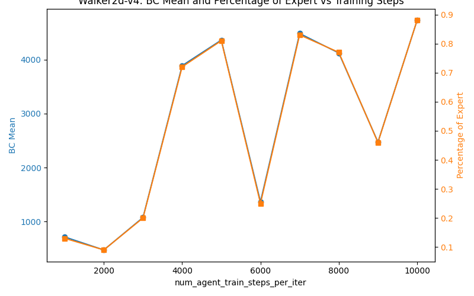
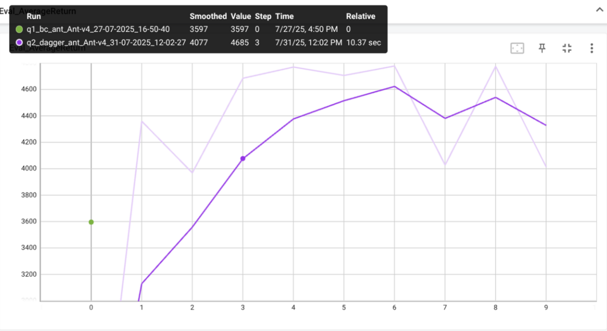
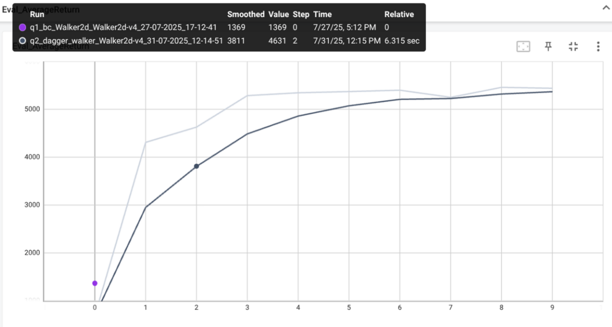

## Results

### Behavior Cloning Results
- all experiments were run with the same hyperparameters listed below
```bash
do_dagger: False
ep_len: 1000
num_agent_train_steps_per_iter: 2000
n_iter: 1
batch_size: 1000
eval_batch_size: 5000
train_batch_size: 100
n_layers: 2
size: 64
learning_rate: 0.005
video_log_freq: -1
scalar_log_freq: 1
no_gpu: False
which_gpu: 0
max_replay_buffer_size: 1000000
save_params: False
seed: 1
```
- Mainly the `num_agent_train_steps_per_iter` was increased to 2000 from 1000
- `eval_batch_size` was set to 5000 to ensure more stable evaluation results
    .ie. 5 samples per environment
#### Results Summary

| Environment | Expert Mean | BC Mean | BC Std | percentage of Expert |
|-------------|--------------|---------|--------|-----------------------|
| Ant-v4     |     4681.892     | 3596.608    | 0.05   | 0.77                  |
| Walker2d-v4| 5383.310        | 475.710    | 925.412   | 0.09                  |
| HalfCheetah-v4|   4034.800   | 3853.242    | 104.32   | 0.95                  |
| Hopper-v4  | 3717.513         | 1093.734    | 196.152 | 0.29                  |

Clearly, halfcheetah is the easiest environment for behavior cloning, while walker2d is the hardest.

#### Hyperparameter tuning for Walker2d-v4
- let's tune num_agent_train_steps_per_iter and batch_size and get the BC mean

| num_agent_train_steps_per_iter | BC Mean | percentage of Expert |
|--------------------------------|---------|-----------------------|
| 1000                           |  716.991 | 0.13                  |
| 2000                           |  475.710 | 0.09                  |
| 3000                           |  1077.006 | 0.20                  |
| 4000                           |  3889.276 | 0.72                  |
| 5000                           |  4362.744 | 0.81                  |
| 6000                           |  1368.754 | 0.25                  |
| 7000                           |  4485.238 | 0.83                  |
| 8000                           |  4123.062 | 0.77                  |
| 9000                           |  2473.817 | 0.46                  |
| 10000                          |  4727.592 | 0.88                  |

- resulting graph for Walker2d-v4



I chose this hyperparameter `num_agent_train_steps_per_iter` to tune because it directly affects the number of training steps taken per iteration, which can significantly impact the performance of the behavior cloning agent. The results show that increasing this parameter generally leads to better performance, with a peak at 5000 steps, after which performance starts to degrade again. This might be because the agent starts to overfit to the training data.

### DAgger Results
- needed the following export to run the DAgger script
```bash
export MUJOCO_GL="egl"
```
- all experiments were run with the same hyperparameters listed below
```bash
Experiment parameters:
expert_policy_file: cs285/policies/experts/Ant.pkl
expert_data: cs285/expert_data/expert_data_Ant-v4.pkl
env_name: Ant-v4
exp_name: dagger_ant
do_dagger: True
ep_len: None
num_agent_train_steps_per_iter: 1000
n_iter: 10
batch_size: 1000
eval_batch_size: 1000
train_batch_size: 100
n_layers: 2
size: 64
learning_rate: 0.005
video_log_freq: 5
scalar_log_freq: 1
no_gpu: False
which_gpu: 0
max_replay_buffer_size: 1000000
save_params: False
seed: 1
```
- Main difference to BC parameters is `do_dagger: True` and `n_iter: 10`
- `num_agent_train_steps_per_iter` was set to 1000 to match the original

- Ant-v4 DAgger results


- Walker2d-v4 DAgger results
